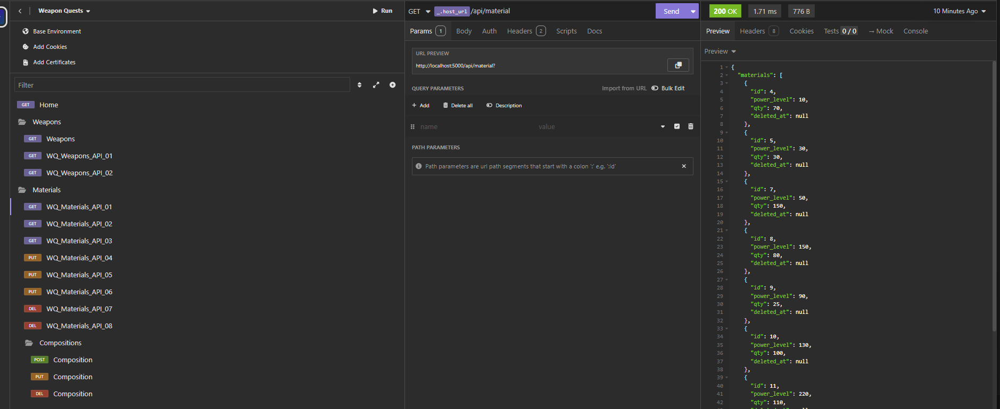
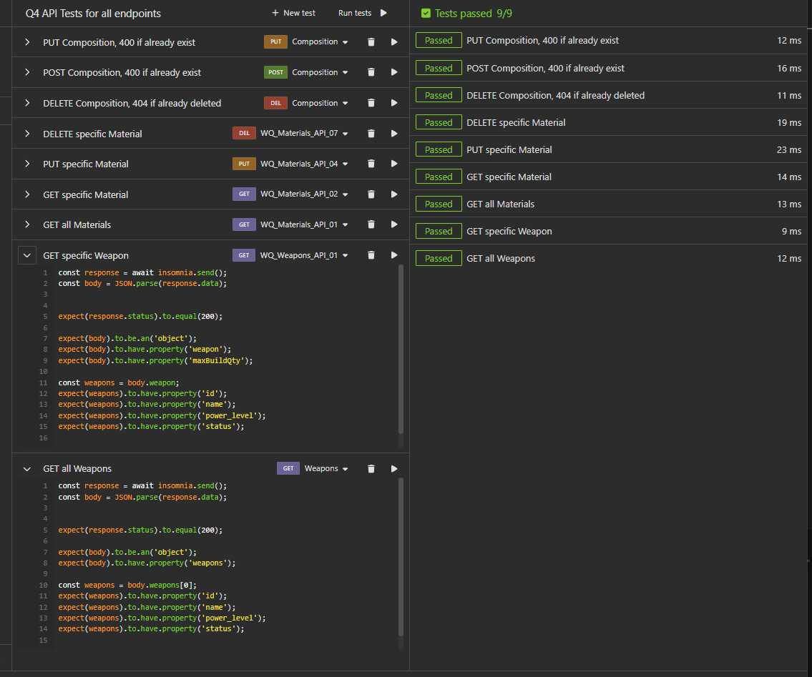

# ⚔️ WEAPON QUEST - QA ⚔️

## Table of Contents
- [⚔️ WEAPON QUEST - QA ⚔️](#️-weapon-quest---qa-️)
  - [Table of Contents](#table-of-contents)
    - [Instructions are as followed:](#instructions-are-as-followed)
    - [Setup:](#setup)
  - [Q3 and Q4](#q3-and-q4)
    - [Question 3](#question-3)
    - [Question 4](#question-4)
  - [Q5](#q5)
    - [list of files changed from original for diffs](#list-of-files-changed-from-original-for-diffs)
    - [Files added to complete this question](#files-added-to-complete-this-question)
    - [How to run](#how-to-run)
    - [Question 5 part 1](#question-5-part-1)
    - [Question 5 part 2](#question-5-part-2)

### Instructions are as followed:

1. Fork the Repository into your own Github (Top right corner) or download project locally
2. Add Jest to the project (Add to package.json), Install all node packages and follow instructions in the docs/getting-started.md
3. Create Test Cases for all Materials API endpoints and for "/api/weapon/:id/maxBuildQuantity" in a "/test_cases" folder
4. Write API Tests for all the endpoints
5. Include an End-to-end test that composes of the following: 
    - Create a weapon that follows the mapping (weapon_qa.png)
    - Calculate the power level of the weapon using a recursive query
6. Share link to Github Repo

 

### Setup:
can follow Q2 for set up in the `docs/getting-started.md` to get appropriate database and all node packages

 

## Q3 and Q4

### Question 3

In the `/test_cases` folder, for convenience I have included a file called `test_cases/q4_weapon_quests_insomnia_collection_and_test_suite.json` to following along with Q3's test cases

[Test Cases format inspiration](https://www.browserstack.com/guide/how-to-write-test-cases)

All test case IDs in the [Test cases document](test_cases/q3_materials_and_maxBuild.md) can be referenced with the Insomnia collection 

### Question 4
  
API endpoints testing was half complete with the original Insomnia Collection. I Took advantage of Insomnia's Design Document Test Suite which uses **Mocha.js** for test framework and **Chai.js** for the assertions.

 
 
 

## Q5
### list of files changed from original for diffs
- `package.json` added Jest and various scripts for testing
- `knexfile.js` added a test environment for modularity and ease of reference with jest
- `jest.config.js` added a test DB environment variable for test DB dependency injection
- `.env` added to fit system requirements and integration
- `/config/dbConfig.js` decoupled test and production DB so different classes can dynamically switch based on environment. See below:
- - `/models/composition.js`
- - `/models/material.js`
- - `/models/weapon.js`

### Files added to complete this question
- `/database/migrations_test` Created separate test DB Migration away from production DB
- `/database/seeds_test` Seeded separate test DB
- **/jest_testing** the main folder for End-to-end test

### How to run

`npm test` in the command line

included scripts `npm run trollback`, `npm run tmigrate`, and `npm run tseed` for convenience and ease of checking/debugging each step of the test DB

### Question 5 part 1
Create a weapon that follows the mapping of the image(weapon_qa.png)

made 2 state hooks on each test to (before hook) rollback, migrate, seed, and (after hook) close database connect to ensure modularity and clean up

Asserted id, name, and composition material matched with image

### Question 5 part 2

called recursive query to calculate power level in the weapons class,`getPowerLevel` method (why making dynamic environment was necessary) which is seeded at `/database/seeds_test/004_test_power_level.js`

Asserted name and correct power level (did the math and tested with production DB to verify this haha)

**extras:**

tested correct seeding and column size for each test table

[Back to Top](#table-of-contents)